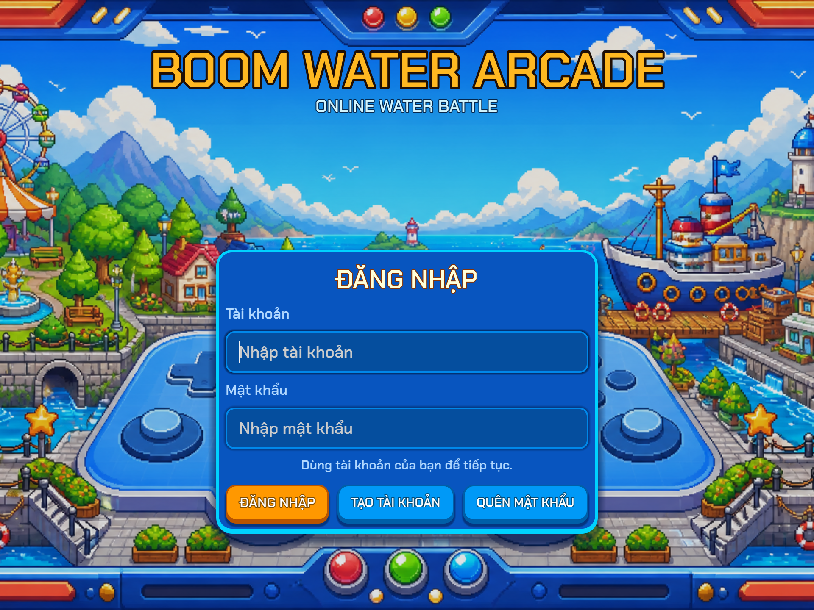
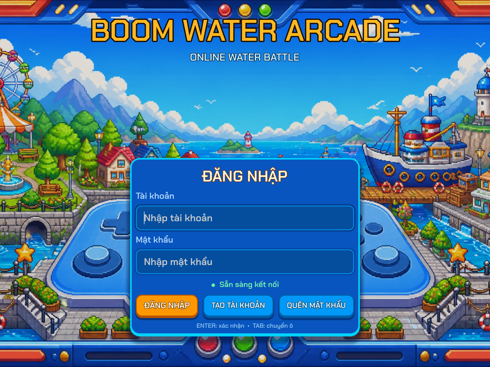

# Polish baseline audit — checkpoint 1

Ngày chụp baseline: 2026-08-24  
Engine: Godot 4.7.1, renderer Forward+, viewport logic 960×720.

## Kết luận nhanh

Dự án đã có một vòng chơi hoàn chỉnh, tài khoản SQLite, phòng chờ, shop/túi đồ, sáu map 16×16, chín bộ animation nhân vật và catalog 65 bóng nước. Phần cần ưu tiên không phải xây lại gameplay mà là gom quyền sở hữu UI/state, làm sạch catalog, đóng các đường cập nhật kinh tế chưa có thẩm quyền máy chủ và thay dần UI tuyệt đối bằng container/theme dùng chung.

Checkpoint này chỉ sửa một màn hình mẫu và lỗi định tuyến test. Không xóa asset, không đổi ID SQL, không đổi economy, không rewrite network.

## Baseline đã xác minh từ game chạy thật

- Login → Lobby → Room → Match → Result → Room đã có luồng thực thi.
- SQL mở và migration chạy; đăng ký, đăng nhập, EXP, Cokecy và cosmetic ownership hoạt động trong smoke test.
- Sáu map active đều là 16×16, có 128 breakable, bốn túi spawn chữ L ba ô và vùng trung tâm 4×4 có đường phá thẳng.
- Bóng nước chặn nổ theo hard/breakable, người đặt được rời ô bóng rồi mới bị khóa quay lại.
- Chín nhân vật dùng 14 clip logic, idle có pose thật và walk có tám frame bước ngắn.
- Kết quả trận tự lên và hẹn quay về phòng sau ba giây.

## Mức độ rủi ro

### P0 — cần chốt trước multiplayer public

1. **Mua bóng nước chưa hoàn toàn server-authoritative.** `GameSession.buy_balloon_skin()` trừ tiền ở client rồi gửi `request_unlock_skin`; phía server hiện có thể ghi ownership mà chưa kiểm tra lại giá, số dư và ownership trong cùng transaction.
2. **Skin đang dùng chưa được xác thực ownership đồng đều.** Room snapshot và lệnh đặt bóng truyền `balloon_skin`, nhưng chưa có bước tương đương `_validated_equipment_for_peer()` dành cho bóng nước.

Đây là rủi ro integrity/economy. Không sửa rộng trong checkpoint vì master prompt yêu cầu dừng xin duyệt trước thay đổi economy/network.

### P1 — nên xử lý trong giai đoạn polish tiếp theo

1. **UI có nhiều chủ sở hữu.** `BootManager.gd`, `MatchHUD.gd`, `Lobby.gd`, `ShopView.gd`, `InventoryView.gd` và `RoomWaitScreen.gd` cùng dựng layout/style.
2. **Theme bị chia đôi.** `game_theme.tres` giữ font, `UITheme.gd` giữ style factory, còn `ui/theme/palette.gd` và `typography.gd` giữ bộ token cũ.
3. **Catalog khai báo 63 nhưng thực tế có 65 skin.** Có source coordinate trùng và hai tọa độ ngoài grid.
4. **ID mặc định không thống nhất.** SQL schema có `classic`, tài khoản mới/GameSession dùng `skin_039`, registry fallback dùng `skin_001`.
5. **TestRunner cũ đã lệch kiến trúc hiện tại.** Runner legacy trả 101 pass/22 fail vì vẫn đòi 8 map, tile 40 px, landmark cũ, path bóng cũ và API `all_skins()`. Exit code cũ không phản ánh số fail.
6. **Các file UI lớn đang ghép nhiều vai trò.** `BootManager.gd` khoảng 1.687 dòng; `MatchHUD.gd` khoảng 1.021 dòng; đây là điểm nóng cho regression giao diện.

### P2 — polish/khả năng mở rộng

- Map runtime chuẩn hóa rất tốt về số block nhưng sáu map đang dùng cùng xương bố cục; khác biệt trang trí runtime còn ít.
- Catalog cũ phụ thuộc convention đường dẫn và metadata đơn ngữ.
- Chưa có visual regression tự động cho mọi màn hình và mọi aspect ratio.

## Thay đổi an toàn đã làm ở checkpoint

- Sửa login sang safe-area + container, thay bố cục tuyệt đối bằng layout co giãn.
- Bổ sung trạng thái ready/pending/success/error, hit target tối thiểu, focus keyboard và style disabled/focus riêng.
- Sửa lỗi headless test tự khởi động dedicated server: server giờ chỉ chạy khi có `--server`.
- Thêm smoke test login ở năm kích thước và performance probe chạy trên renderer thật.

## Kết quả kiểm thử

- Login layout matrix: 40 pass / 0 fail.
- Account database: 19 / 0.
- Map layout: 90 / 0.
- Map gameplay regression: 48 / 0.
- Balloon exit/collision: 4 / 0.
- Character animation: 22 / 0.
- Playable loop: 17 / 0.

## Hình runtime trước/sau

## Quyết định cần duyệt

1. Cho phép chi tối đa **0,42 USD** để tạo sáu sample sheet lần đầu; ngân sách trần **0,84 USD** nếu mỗi mẫu cần một lần retry.
2. Chọn một review bắt buộc cho checkpoint: Bugbot hoặc Security Review.
3. Duyệt kế hoạch migration ID theo hướng giữ nguyên mọi ID SQL và chỉ thêm alias/metadata trước.

