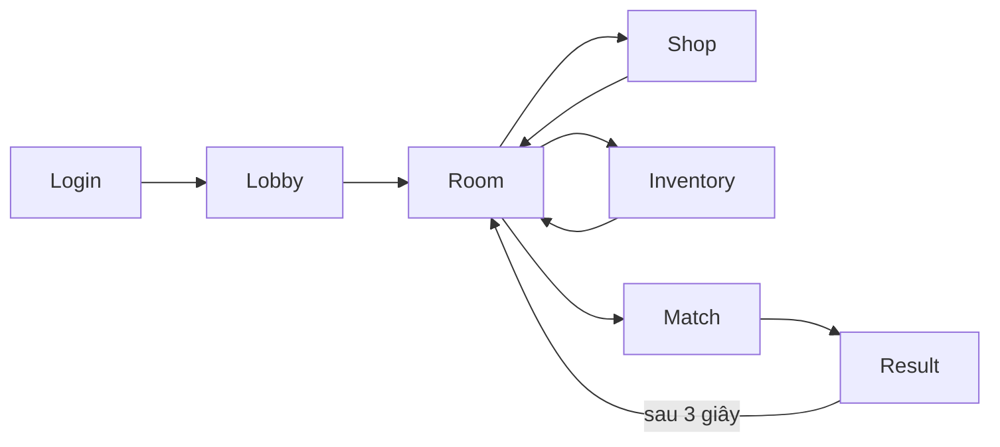
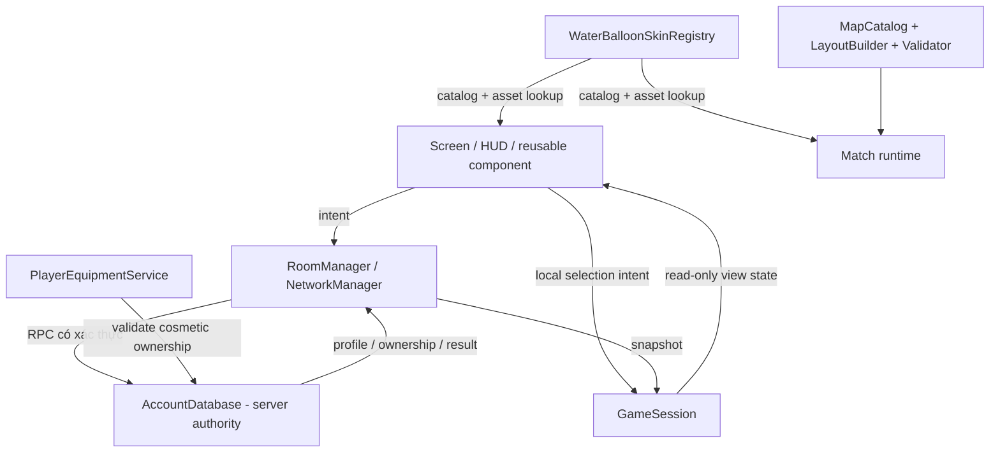

# UI flow và state ownership

## Luồng màn hình chuẩn

Mỗi màn hình chỉ render state và gửi intent. Không màn hình nào được tự quyết định tiền, EXP, ownership hoặc kết quả mạng.

## Chủ sở hữu state

## Hợp đồng trách nhiệm

| Thành phần | Sở hữu | Không được sở hữu |
|---|---|---|
| `AccountDatabase` | account, hash, Cokecy, EXP/level, ownership, selected IDs, transaction | visual state, animation |
| `RoomManager` | room roster, ready state, replicated equipment/skin snapshot | giá item, asset texture |
| `GameSession` | cache phiên client, lựa chọn hiện tại, config match | quyền quyết định mua hàng |
| `PlayerEquipmentService` | validate/equip cosmetic qua server | giá bóng nước |
| `WaterBalloonSkinRegistry` | immutable catalog lookup, fallback, asset paths | ownership, tiền |
| `MapCatalog`/`MapLayoutBuilder`/`MapValidator` | definition 16×16, collision/spawn contract | HUD, player profile |
| UI screen/component | render, focus, input intent, transition visual | mutation SQL/network authority |

## Ranh giới multiplayer bắt buộc

Server phải xác thực và commit atomically:

- đăng ký/đăng nhập;
- mua cosmetic và bóng nước;
- trang bị item;
- cộng/trừ Cokecy;
- cộng EXP/level;
- skin/equipment hợp lệ trong room và match;
- kết quả trận.

Client được dự đoán UI nhưng phải rollback nếu server từ chối. Không dùng giá hoặc ownership do client gửi làm nguồn sự thật.

## Kế hoạch tách file UI lớn

1. Giữ màn hình làm controller mỏng.
2. Tách `RoomRosterPanel`, `CharacterSelector`, `MapSelector`, `ChatPanel`, `CurrencyHeader`, `ResultTable` thành component.
3. Mọi component lấy style từ `UITheme.gd`; không tạo màu/radius cục bộ mới.
4. Thêm screen state enum (`ENTERING`, `READY`, `BUSY`, `ERROR`, `LEAVING`) để chống double-submit và transition chồng nhau.

